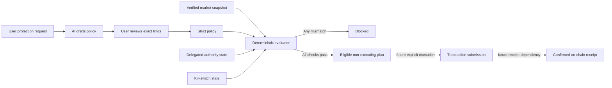

# Overnight protection authority

## Status

Convey currently has a pure, non-executing policy evaluator. It can decide whether a proposed Thetanuts options action fits a user-authored overnight policy. It cannot sign, approve token allowance, submit a trade, or prove settlement.

This separation is intentional. An AI model may translate plain language into a candidate policy, but deterministic code must validate every field and the user must explicitly install any future delegated authority.

Before any authority is requested, `previewOvernightProtectionLimits` produces an enforceable disclosure containing the exact policy hash/version, per-trade spend ceiling, cumulative spend ceiling, cumulative loss ceiling, trade count, and active window. This disclosure is available with no wallet or delegated authority. It remains non-executing and gives the user the precise limits that a future permission must match.

## Policy boundary

An overnight policy binds all material choices:

- underlying asset;
- put or call;
- buy or sell side;
- objective;
- premium cap for one trade and the whole active policy;
- cumulative maximum loss, including already committed positions;
- maximum trade count;
- minimum and maximum time to option expiry;
- maximum quote age;
- maximum slippage;
- start and end of the active window;
- authority mode; and
- kill-switch version.

Evaluation fails closed when market data is stale or unavailable, any bound field differs, a cap is exceeded, authority is absent or expired, or the kill switch is engaged or has an unexpected version. Premium and loss accounting include all positions already committed under the policy. Delegated authority must bind the exact canonical policy hash and version; a human-readable ID is not sufficient. Its own premium and loss ceilings may never exceed policy ceilings. An eligible result still says `execution: "none"` and `requiresExplicitExecution: true`.

## Authority decision

### Recommended: smart account with a scoped session key

The preferred production design is a smart account whose installed session permission is narrower than the account owner’s authority. The permission should bind the target chain, Thetanuts contracts, collateral token, method selectors, absolute spend, expiry time, trade count, and policy hash. Revocation and the kill switch must be enforceable without relying on the AI service.

Advantages:

- funds remain in the user-controlled account;
- authority expires automatically;
- scope and spend can be checked on-chain;
- the owner can revoke one session without rotating the main wallet; and
- a compromised agent cannot freely transfer assets or call unrelated contracts.

This is the target architecture, not a current capability. Before calling it autonomous, Convey still needs a compatible smart-account implementation, audited permission enforcement, wallet approval UX, transaction simulation, and confirmed receipt handling.

### Fallback: narrowly funded agent wallet

A separate agent wallet could be funded with no more than the overnight premium budget. This limits immediate capital at risk and may be easier to prototype when the target protocol lacks smart-account session support.

Its tradeoffs are worse:

- Convey or an external key service becomes responsible for key custody;
- a leaked key can ignore off-chain policy checks;
- replenishment, recovery, and withdrawal controls add operational risk; and
- users must trust that the wallet contains only the advertised bounded funds.

If this fallback is ever used, the wallet must be isolated per user or policy, funded only to the explicit cap, barred from arbitrary withdrawals, protected by an independent kill switch, and emptied when the window closes. A general hot wallet or server-held user key is not acceptable.

## Required execution gates

A future executor must re-evaluate immediately before submission and stop on any of these conditions:

1. Quote age exceeds the policy limit or the market provider is unavailable.
2. Underlying, option type, side, objective, expiry, cumulative premium, cumulative loss, trade count, or slippage differs from policy.
3. Delegated authority is missing, expired, wrong-mode, underfunded, or cannot be independently verified.
4. Kill switch is engaged or its version differs from the installed policy.
5. Transaction simulation fails or produces calls outside the allowlist.
6. A prior trade may have consumed the same policy allowance and current totals cannot be proven.

Retries must be idempotent. A timeout is not proof that a transaction failed; the executor must reconcile by transaction hash or policy nonce before attempting another submission.

## Receipt dependency

Live execution remains blocked until Convey can bind three distinct records:

- the approved policy and authority version;
- the exact quoted order and transaction intent; and
- a confirmed on-chain transaction receipt with final status and resulting position.

After submission, an independent verifier must query chain state and verify the Thetanuts `OrderFilled` event against the approved policy hash, transaction intent, option-book contract, maker/order identity, buyer account, amount, and chain. It must not trust the executor’s success response or a transaction hash alone. Only a successful transaction receipt plus matching `OrderFilled` log creates a Convey execution receipt. A missing, reverted, ambiguous, or mismatched event leaves the action unconfirmed and consumes no claimed receipt.

An AI-provider request ID or metadata receipt proves only that an inference request occurred. It does not prove wallet authorization, transaction submission, or settlement. Until the on-chain receipt path exists, the UI may show policy simulation and eligibility only, clearly labeled as non-executing.

## Current implementation

- `lib/companion/overnight-policy.ts` owns strict schemas and pure evaluation.
- `tests/companion/overnight-policy.test.ts` covers caps, freshness, mismatches, authority, active windows, slippage, and kill-switch behavior.
- No private key, signer, provider SDK, wallet call, or transaction builder is present in this module.
